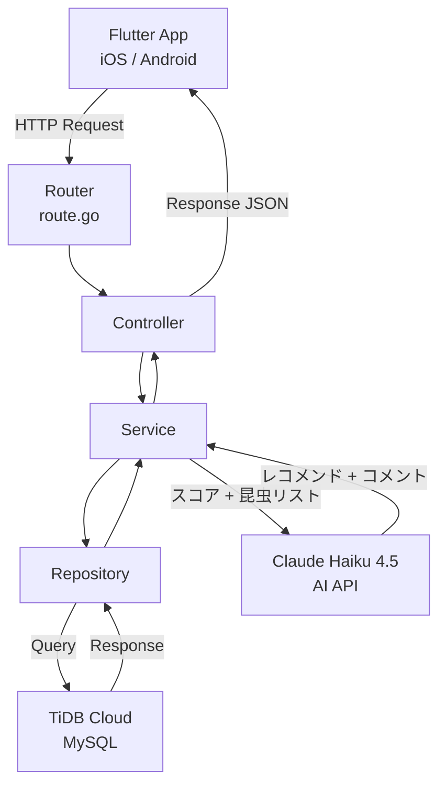

# アーキテクチャ設計書 | 昆虫食初心者ガイド

上記の要件をベースに、個人開発向けのシンプルなアーキテクチャを設計する。

## 制約

- 個人開発（一人）
- 低コスト重視
- 運用が簡単

---

## 技術スタック

- **フロントエンド**: Flutter + Dart
- **バックエンド**: Go + Gin（Cloud Run）
- **データベース**: MySQL互換（TiDB Cloud Starter）
- **AI API**: Claude Haiku 4.5（昆虫レコメンド・コメント生成）
- **認証**: なし（MVP段階）
- **インフラ**: Cloud Run + TiDB Cloud

---

## システム構成図



---

## アプリケーション構成

バックエンドは三層アーキテクチャで実装する。

| 層          | 役割               | 具体例                                  |
|------------|------------------|--------------------------------------|
| Router     | ルーティング（route.go） | エンドポイントの定義・Controllerへの振り分け          |
| Controller | リクエスト/レスポンスの処理   | リクエストのバリデーション・Serviceの呼び出し・レスポンスの返却  |
| Service    | ビジネスロジック         | カテゴリ別スコアの集計・Claude APIの呼び出し・レスポンスの整形 |
| Repository | DBアクセス・データの取得・保存 | 昆虫一覧の取得・質問のランダム取得                    |

各層はインターフェースを介してやり取りをする。GoのDuck Typingを活かし、各層がインターフェースに依存する設計とする。

これにより以下のメリットを得る。

- DBの変更が発生した場合、変更箇所をRepository層内に抑え込むことができ、ControllerやServiceへの影響を最小限に抑える
- 本番DB実装・インメモリ実装・モック実装を切り替え可能にすることでテストの容易性を確保する

---

## Flutter構成

| 項目         | ライブラリ     | 概要                 |
|------------|-----------|--------------------|
| 状態管理       | Riverpod  | 現在主流・テストしやすい・DI対応  |
| HTTPクライアント | dio       | API通信・エラーハンドリングが充実 |
| レーダーチャート   | fl_chart  | 昆虫詳細画面のレーダーチャート表示  |
| ルーティング     | go_router | 画面遷移の管理            |

**バックエンドとの層対応**

| バックエンド | フロントエンド | 役割 |
|---|---|---|
| `routers/router.go` | `app.dart` | ルーティング定義 |
| `controllers/*.go` | `features/*/pages/` | 画面・UI表示 |
| `services/*.go` | `features/*/providers/` | ビジネスロジック・状態管理 |
| `repositories/*.go` | `features/*/repositories/` | APIアクセス |
| `repositories/*_interface.go` | `features/*/repositories/*_interface.dart` | 抽象クラス（DI・モック差し替え用） |
| `models/*.go` | `features/*/models/` | データモデル定義 |

**フォルダ構成**

```
lib/
├── main.dart
├── app.dart                              # routers/ に対応（go_router設定）
│
├── features/                             # 機能ごとに分ける
│   ├── top/                              # トップ画面
│   │   └── pages/
│   │       └── top_page.dart
│   │
│   ├── insects/                          # 昆虫関連
│   │   ├── models/                       # models/ に対応
│   │   │   └── insect.dart
│   │   ├── repositories/                 # repositories/ に対応（APIアクセス）
│   │   │   ├── insect_repository.dart
│   │   │   └── insect_repository_interface.dart
│   │   ├── providers/                    # services/ に対応（ビジネスロジック）
│   │   │   └── insects_provider.dart
│   │   └── pages/                        # controllers/ に対応（画面）
│   │       ├── insects_page.dart
│   │       └── insect_detail_page.dart
│   │
│   ├── diagnosis/                        # 診断関連
│   │   ├── models/
│   │   │   └── diagnosis.dart
│   │   ├── repositories/
│   │   │   ├── diagnosis_repository.dart
│   │   │   └── diagnosis_repository_interface.dart
│   │   ├── providers/
│   │   │   └── diagnosis_provider.dart
│   │   └── pages/
│   │       ├── diagnosis_page.dart
│   │       └── diagnosis_result_page.dart
│   │
│   └── questions/                        # 質問関連
│       ├── models/
│       │   └── question.dart
│       ├── repositories/
│       │   ├── question_repository.dart
│       │   └── question_repository_interface.dart
│       └── pages/
│           └── question_page.dart
│
└── shared/                               # 共通部品
    ├── widgets/                          # 共通ウィジェット
    ├── theme/                            # テーマ・カラー
    └── api/                              # API通信の共通処理
        └── api_client.dart
```

> **インターフェース（抽象クラス）について**
> バックエンドの `*_interface.go` と同じ考え方。`insect_repository_interface.dart` に抽象クラスを定義し、本実装（APIを叩く）とモック実装（固定データを返す）を切り替えられるようにする。バックエンド未完成時にモックで先行開発できる。

---

## バックエンド構成（Go/Gin）

**フォルダ構成**

```
.
├── main.go
├── Dockerfile
├── docker-compose.yml
├── Makefile
│
├── cmd/
│   └── server/
│       └── main.go             # サーバー起動
│
├── internal/
│   ├── routers/
│   │   └── router.go           # ルーティング定義
│   │
│   ├── controllers/            # リクエスト/レスポンス処理
│   │   ├── insect_controller.go
│   │   ├── question_controller.go
│   │   └── diagnosis_controller.go
│   │
│   ├── services/               # ビジネスロジック
│   │   ├── insect_service.go
│   │   ├── insect_service_interface.go
│   │   ├── question_service.go
│   │   ├── question_service_interface.go
│   │   ├── diagnosis_service.go
│   │   └── diagnosis_service_interface.go
│   │
│   ├── repositories/           # DBアクセス
│   │   ├── insect_repository.go
│   │   ├── insect_repository_interface.go
│   │   ├── question_repository.go
│   │   └── question_repository_interface.go
│   │
│   ├── models/                 # DBのモデル定義
│   │   ├── insect.go
│   │   ├── radar_chart.go
│   │   └── question.go
│   │
│   ├── dtos/                   # リクエスト/レスポンスの型定義
│   │   ├── insect_dto.go
│   │   ├── question_dto.go
│   │   └── diagnosis_dto.go
│   │
│   └── infrastructure/         # 外部サービス連携
│       ├── database/
│       │   └── db.go           # DB接続
│       └── ai/
│           └── claude_client.go # Claude API クライアント
│
└── rdb/
    └── migrations/             # マイグレーションファイル
        ├── 000001_create_insects_table.up.sql
        ├── 000001_create_insects_table.down.sql
        ├── 000002_create_radar_charts_table.up.sql
        ├── 000002_create_radar_charts_table.down.sql
        ├── 000003_create_questions_table.up.sql
        └── 000003_create_questions_table.down.sql
```

| 項目       | ツール                         | 概要                     |
|----------|-----------------------------|------------------------|
| コンテナ管理   | Docker + docker-compose     | アプリ・DBをコンテナで管理         |
| ホットリロード  | air                         | コード変更を検知して自動再起動        |
| ORM        | GORM                        | DBアクセスをGoの構造体で管理        |
| マイグレーション | golang-migrate（Makefileで管理） | up/downセットで管理・ロールバック可能 |
| テスト実行    | ginkgo（Makefileで管理）         | 各層のユニットテスト実行           |

**マイグレーションの運用イメージ**

```
rdb/migrations/
├── 000001_create_insects_table.up.sql
├── 000001_create_insects_table.down.sql
├── 000002_create_questions_table.up.sql
└── 000002_create_questions_table.down.sql

# 実行コマンド
make migrate-up    # 前進
make migrate-down  # 巻き戻し
```

---

## 選定理由

- **Flutter**: 会社で使用しているBubbleのリプレイス候補として、先行して個人開発で技術検証するため
- **Go / Gin**: 会社のBubbleバックエンドがGin構築のため、既存の技術スタックに合わせて選定
- **MySQL互換（TiDB Cloud）**: 低コスト重視の制約に基づき、MySQL互換で無料枠が5GBと大きいTiDB Cloud Starterを選定
- **Cloud Run**: サーバーレスのためリクエストがない時のコストがゼロ。無料枠が月200万リクエストと大きい。AWSのECS + Fargateも同等の構成として選択肢にあったが、クラスター・タスク定義・IAM・ALBなど設定が多くインフラ構築に時間をかけたくなかった。Cloud Runは`gcloud run deploy`一発でデプロイできるシンプルさが魅力。また昆虫食に興味を持つ人に広くリーチしたいというアプリの性質上、大規模なインフラは不要で、無料枠で十分カバーできると判断した
- **Claude Haiku 4.5**: コスト・レスポンス速度・品質のバランスがMVPに適しているため選定。上位モデルより大幅に安価で、80〜100文字のコメント生成には十分な性能
- **Google Cloud Storage**: Cloud Runと同じGCPで管理を統一できるため選定。S3を使う場合GCPとAWSをまたぐことになり認証・管理が複雑になる。このアプリの性質上大規模なインフラは不要で、無料枠（5GB・転送量無料）で十分と判断した

---

## 初期コスト（月額）

- Cloud Run: $0（無料枠内）
- TiDB Cloud Starter: $0（無料枠内・5GB）
- Google Cloud Storage: $0（無料枠内・5GB）
- Claude Haiku 4.5 API: 約$0.1（100人全員が診断した場合の上限）
- **合計**: 約$0.1/月
