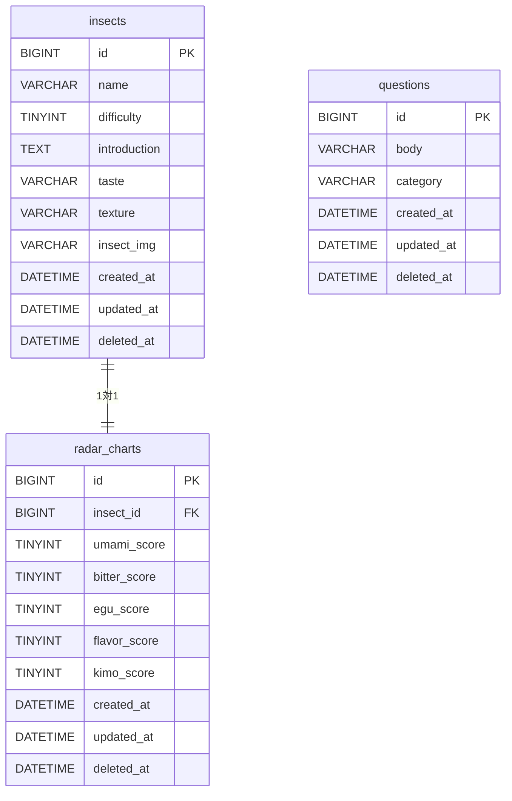

# データベース設計書 | 昆虫食初心者ガイド


## 1. 概要

| 項目 | 内容 |
|---|---|
| DBMS | MySQL（TiDB Cloud Starter / ローカルはDocker） |
| 文字コード | utf8mb4 |

---

## 2. テーブル一覧

| テーブル名 | 説明 |
|---|---|
| insects | 昆虫情報 |
| radar_charts | 昆虫のレーダーチャート用スコア |
| questions | 診断質問 |

---

## 3. テーブル定義

### insects

| カラム名 | 型 | NULL | 説明 |
|---|---|---|---|
| id | BIGINT UNSIGNED | NOT NULL | PK |
| name | VARCHAR(100) | NOT NULL | 昆虫名 |
| difficulty | TINYINT UNSIGNED | NOT NULL | 難易度（★1〜★5） |
| introduction | TEXT | NOT NULL | 昆虫の説明 |
| taste | VARCHAR(100) | NOT NULL | 味の説明 |
| texture | VARCHAR(100) | NOT NULL | 食感の説明 |
| insect_img | VARCHAR(255) | NULL | 画像URL |
| created_at | DATETIME | NOT NULL | 作成日時 |
| updated_at | DATETIME | NOT NULL | 更新日時 |
| deleted_at | DATETIME(3) | NULL | 論理削除日時 |

### radar_charts

| カラム名 | 型 | NULL | 説明 |
|---|---|---|---|
| id | BIGINT UNSIGNED | NOT NULL | PK |
| insect_id | BIGINT UNSIGNED | NOT NULL | FK（insects.id） |
| umami_score | TINYINT UNSIGNED | NOT NULL | 旨味スコア（1〜5） |
| bitter_score | TINYINT UNSIGNED | NOT NULL | 苦味スコア（1〜5） |
| egu_score | TINYINT UNSIGNED | NOT NULL | エグ味スコア（1〜5） |
| flavor_score | TINYINT UNSIGNED | NOT NULL | 風味スコア（1〜5） |
| kimo_score | TINYINT UNSIGNED | NOT NULL | キモみスコア（1〜5） |
| created_at | DATETIME | NOT NULL | 作成日時 |
| updated_at | DATETIME | NOT NULL | 更新日時 |
| deleted_at | DATETIME(3) | NULL | 論理削除日時 |

### questions

| カラム名 | 型 | NULL | 説明 |
|---|---|---|---|
| id | BIGINT UNSIGNED | NOT NULL | PK |
| body | VARCHAR(255) | NOT NULL | 質問文 |
| category | ENUM('visual','physical','mental') | NOT NULL | カテゴリ（visual / physical / mental） |
| created_at | DATETIME | NOT NULL | 作成日時 |
| updated_at | DATETIME | NOT NULL | 更新日時 |
| deleted_at | DATETIME(3) | NULL | 論理削除日時 |

**カテゴリ定義**

| カテゴリ | 意味 | 測る内容 |
|---|---|---|
| visual | 視覚耐性 | 虫を目で見たときの耐性。虫の見た目に対してどれだけ抵抗がないかを測る |
| physical | 身体耐性 | 実際に触る・食べる行動への耐性。虫を食べる行動ができるかを測る |
| mental | 精神耐性 | 食への冒険心・気持ちの耐性。新しい食体験に挑戦しようという気持ちがあるかを測る |

---

## 4. ER図



---

## 5. 初期データ（昆虫10種類）

| name | difficulty | taste | texture |
|---|---|---|---|
| コオロギパウダー | 1 | ナッツ系 | サラサラ |
| ミールワーム | 1 | 淡白 | サクサク |
| シルクワーム | 2 | クリーミー | もちもち |
| ハチの子 | 2 | 甘い | プリプリ |
| イナゴの佃煮 | 3 | 甘辛 | カリカリ |
| カイコ | 3 | 淡白 | ふわふわ |
| タガメ | 4 | フルーティー | パリパリ |
| ゲンゴロウ | 4 | 苦味あり | カリカリ |
| サソリ | 5 | エビ系 | パリパリ |
| タランチュラ | 5 | 鶏肉系 | もちもち |

---

## 6. 初期データ（質問12問）

| body | category |
|---|---|
| 虫が出てくる映像や画像を抵抗なく見られる | visual |
| 昆虫の形がそのまま残っている食べ物でも食べられそう | visual |
| グロテスクな見た目のものでも食べ物なら挑戦できる | visual |
| 虫の標本や写真を見ても気分が悪くならない | visual |
| 虫を手で触ったことがある | physical |
| 生き物をそのまま食べることに抵抗がない | physical |
| 屋台などで正体不明の食べ物を食べたことがある | physical |
| 見た目が気になっても一口食べてみることができる | physical |
| 食べ物の見た目より味や栄養を優先できる | mental |
| 周りが驚くようなことに挑戦するのが好き | mental |
| 新しい食体験にワクワクする方だ | mental |
| 話のネタのためなら多少無理をして食べられる | mental |

---

## 8. マイグレーション運用

### ファイル構成

```
rdb/migrations/
├── 000001_create_insects_table.up.sql
├── 000001_create_insects_table.down.sql
├── 000002_create_radar_charts_table.up.sql
├── 000002_create_radar_charts_table.down.sql
├── 000003_create_questions_table.up.sql
├── 000003_create_questions_table.down.sql
├── 000004_alter_tinyint_to_unsigned.up.sql
├── 000004_alter_tinyint_to_unsigned.down.sql
├── 000005_add_deleted_at_columns.up.sql
└── 000005_add_deleted_at_columns.down.sql
```

### ローカル環境

```bash
make migrate-up    # マイグレーション実行（前進）
make migrate-down  # マイグレーション巻き戻し
```

### 本番環境（TiDB Cloud）

```
TiDB Cloudの管理画面（SQL Editor）から
以下のSQLをコピペして実行する
```

### 000001_create_insects_table.up.sql

```sql
BEGIN;

CREATE TABLE IF NOT EXISTS `insects`
(
    `id`           BIGINT UNSIGNED NOT NULL AUTO_INCREMENT COMMENT '昆虫の識別子',
    `name`         VARCHAR(100)    NOT NULL COMMENT '昆虫名',
    `difficulty`   TINYINT         NOT NULL COMMENT '難易度（★1〜★5）',
    `introduction` TEXT            NOT NULL COMMENT '昆虫の説明',
    `taste`        VARCHAR(100)    NOT NULL COMMENT '味の説明',
    `texture`      VARCHAR(100)    NOT NULL COMMENT '食感の説明',
    `insect_img`   VARCHAR(255)             COMMENT '画像URL',
    `created_at`   DATETIME        NOT NULL DEFAULT CURRENT_TIMESTAMP COMMENT 'レコードの作成日時',
    `updated_at`   DATETIME        NOT NULL DEFAULT CURRENT_TIMESTAMP ON UPDATE CURRENT_TIMESTAMP COMMENT 'レコードの更新日時',
    PRIMARY KEY (`id`)
) ENGINE = InnoDB DEFAULT CHARSET = utf8mb4 COMMENT = '昆虫情報を管理するテーブル';

COMMIT;
```

### 000001_create_insects_table.down.sql

```sql
BEGIN;
DROP TABLE IF EXISTS `insects`;
COMMIT;
```

### 000002_create_radar_charts_table.up.sql

```sql
BEGIN;

CREATE TABLE IF NOT EXISTS `radar_charts`
(
    `id`           BIGINT UNSIGNED NOT NULL AUTO_INCREMENT COMMENT 'レーダーチャートの識別子',
    `insect_id`    BIGINT UNSIGNED NOT NULL COMMENT '昆虫の識別子（insectsテーブルのFK）',
    `umami_score`  TINYINT         NOT NULL COMMENT '旨味スコア（1〜5）',
    `bitter_score` TINYINT         NOT NULL COMMENT '苦味スコア（1〜5）',
    `egu_score`    TINYINT         NOT NULL COMMENT 'エグ味スコア（1〜5）',
    `flavor_score` TINYINT         NOT NULL COMMENT '風味スコア（1〜5）',
    `kimo_score`   TINYINT         NOT NULL COMMENT 'キモみスコア（1〜5）',
    `created_at`   DATETIME        NOT NULL DEFAULT CURRENT_TIMESTAMP COMMENT 'レコードの作成日時',
    `updated_at`   DATETIME        NOT NULL DEFAULT CURRENT_TIMESTAMP ON UPDATE CURRENT_TIMESTAMP COMMENT 'レコードの更新日時',
    PRIMARY KEY (`id`),
    CONSTRAINT `fk_radar_charts_insect_id` FOREIGN KEY (`insect_id`) REFERENCES `insects` (`id`) ON DELETE CASCADE ON UPDATE CASCADE
) ENGINE = InnoDB DEFAULT CHARSET = utf8mb4 COMMENT = '昆虫のレーダーチャート用スコアを管理するテーブル';

COMMIT;
```

### 000002_create_radar_charts_table.down.sql

```sql
BEGIN;
DROP TABLE IF EXISTS `radar_charts`;
COMMIT;
```

### 000003_create_questions_table.up.sql

```sql
BEGIN;

CREATE TABLE IF NOT EXISTS `questions`
(
    `id`         BIGINT UNSIGNED                       NOT NULL AUTO_INCREMENT COMMENT '質問の識別子',
    `body`       VARCHAR(255)                          NOT NULL COMMENT '質問文',
    `category`   ENUM ('visual', 'physical', 'mental') NOT NULL COMMENT 'カテゴリ（visual: 視覚耐性 / physical: 身体耐性 / mental: 精神耐性）',
    `created_at` DATETIME                              NOT NULL DEFAULT CURRENT_TIMESTAMP COMMENT 'レコードの作成日時',
    `updated_at` DATETIME                              NOT NULL DEFAULT CURRENT_TIMESTAMP ON UPDATE CURRENT_TIMESTAMP COMMENT 'レコードの更新日時',
    PRIMARY KEY (`id`)
) ENGINE = InnoDB DEFAULT CHARSET = utf8mb4 COMMENT = '診断質問を管理するテーブル';

COMMIT;
```

### 000003_create_questions_table.down.sql

```sql
BEGIN;
DROP TABLE IF EXISTS `questions`;
COMMIT;
```

## 9. 将来追加予定テーブル

| テーブル名 | 説明 | 追加タイミング |
|---|---|---|
| users | ユーザー情報 | 認証機能実装時 |
| bookmarks | お気に入り | お気に入り機能実装時 |
| reviews | レビュー | レビュー機能実装時 |
