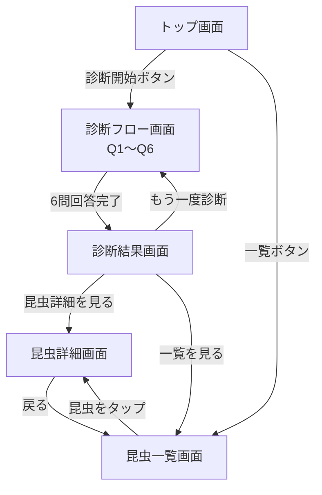

# サイトマップ設計書｜昆虫食初心者ガイド

---

## 1. 画面一覧

| 画面名     | パス                  | 概要               |
|---------|---------------------|------------------|
| トップ画面   | `/`                 | アプリの説明・診断開始ボタン   |
| 診断フロー画面 | `/diagnosis`        | カテゴリ別6問を1問ずつ表示   |
| 診断結果画面  | `/diagnosis/result` | AIレコメンド昆虫・コメント表示 |
| 昆虫一覧画面  | `/insects`          | 登録昆虫の一覧表示        |
| 昆虫詳細画面  | `/insects/:id`      | 昆虫の詳細・レーダーチャート表示 |

---

## 2. 画面遷移図



---

## 3. 画面詳細

### トップ画面

| 項目     | 内容                                                             |
|--------|----------------------------------------------------------------|
| 役割     | アプリの紹介・診断への導線                                                  |
| 主なUI要素 | アプリロゴ・キャッチコピー・ターゲット説明（どんな人向き？）・昆虫食のメリット紹介・診断説明・診断開始ボタン・昆虫一覧ボタン |

**ターゲット説明（例）**

```
こんな人におすすめ！
└ 昆虫食に興味はあるけど何から始めたらいいかわからない
└ 虫は苦手だけど話のネタに試してみたい
└ 健康・環境に興味がある
```

**昆虫食のメリット（例）**

```
└ 高タンパク・低カロリー
└ 環境負荷が低い次世代食材
└ 意外と美味しい！
```

**診断説明**

```
3つの耐性で診断します

👁  見た目への耐性
    虫の見た目に対してどれだけ抵抗がないかを測ります

🤚 食べる勇気
    実際に虫を食べる行動にどれだけ踏み出せるかを測ります

💪 挑戦する気持ち
    新しい食体験に挑戦しようという気持ちがあるかを測ります

全6問・所要時間1分
```

---

### 診断フロー画面

| 項目     | 内容                          |
|--------|-----------------------------|
| 役割     | カテゴリ別6問をはい/いいえで回答           |
| 主なUI要素 | 質問文・はいボタン・いいえボタン・進捗バー（Q1/6） |
| 状態管理   | 現在の質問番号・各回答結果・カテゴリ別スコア      |

---

### 診断結果画面

| 項目     | 内容                                   |
|--------|--------------------------------------|
| 役割     | AIがレコメンドした昆虫とコメントを表示                 |
| 主なUI要素 | 昆虫画像・昆虫名・難易度（★）・AIコメント・詳細ボタン・もう一度ボタン |
| API    | POST /api/v1/diagnosis               |

---

### 昆虫一覧画面

| 項目     | 内容                  |
|--------|---------------------|
| 役割     | 登録されている昆虫の一覧を表示     |
| 主なUI要素 | 昆虫カード一覧（画像・名前・難易度★） |
| API    | GET /api/v1/insects |

---

### 昆虫詳細画面

| 項目     | 内容                               |
|--------|----------------------------------|
| 役割     | 昆虫の詳細情報とレーダーチャートを表示              |
| 主なUI要素 | 昆虫画像・名前・難易度（★）・説明文・味・食感・レーダーチャート |
| API    | GET /api/v1/insects/:id          |
